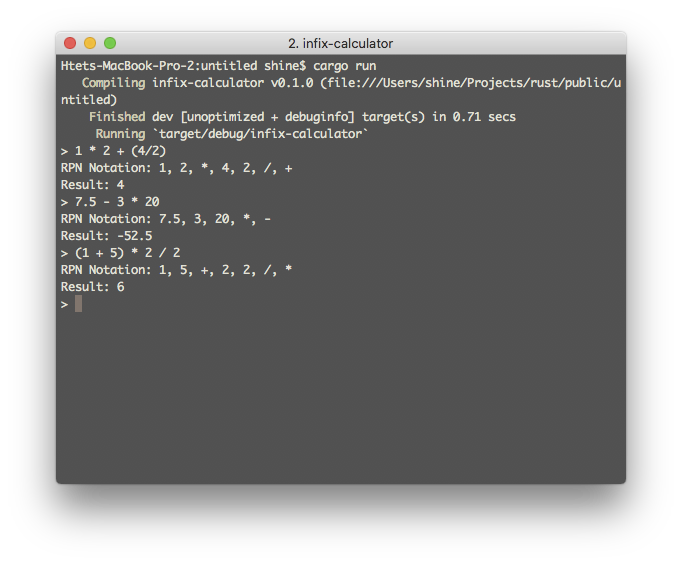

Infix-Calculator
----------------
Infix-Calculator is a interactive calculator written in Rust.
Currently it supports decimals and round brackets.
This is part of a series of small projects I will be doing in Rust to make myself familiar with the language.

### Screenshot of infix-calculator



### Building and running

```
$ git clone https://github.com/ha-shine/infix-calculator
$ cd infix-calculator
$ cargo run
```